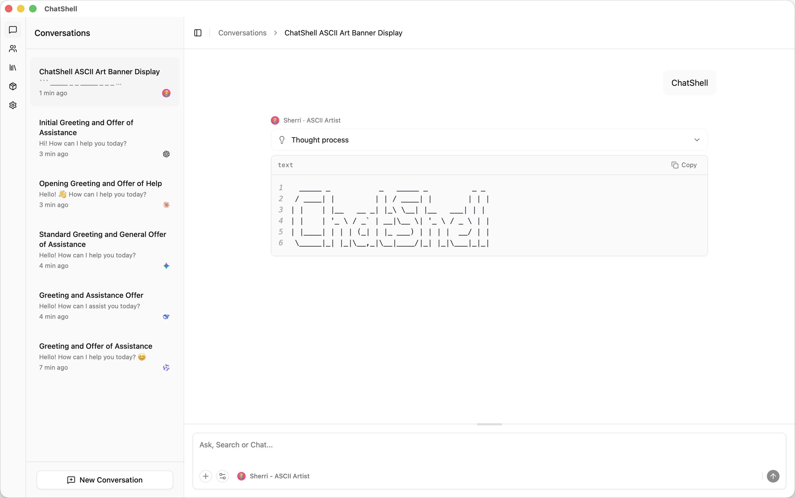

# ChatShell

**Your AI, in a Shell. Stand Alone, Yet Connected.**

[](https://github.com/chatshellapp/chatshell-desktop/stargazers)
[](LICENSE)
[](https://www.rust-lang.org/)
[](https://react.dev/)

ChatShell is an open-source desktop AI client built with Tauri 2 and React 19. Chat with any model, grant them web access, watch them think, and create groups — all in a native, privacy-first app.

[Website](https://chatshell.app/) | [GitHub](https://github.com/chatshellapp/chatshell-desktop) | [Issues](https://github.com/chatshellapp/chatshell-desktop/issues)

---

## Screenshot



---

## Features

### 🤖 Multi-Model Support

- **Cloud Providers**: OpenAI, OpenRouter
- **Local Models**: Ollama (run LLMs entirely on your machine)
- **Smart Model Discovery**: Automatically fetch available models from providers
- **Configurable Parameters**: Temperature, context length, and more

### 💬 Rich Conversations

- **Streaming Responses**: See AI thoughts as they generate
- **Thinking Display**: View reasoning process (for supported models)
- **Auto Title Generation**: Smart conversation titling
- **Message History**: Persistent local storage

### 📎 Powerful Attachments

- **Drag & Drop**: Easily attach files to conversations
- **Clipboard Paste**: Paste images directly from clipboard
- **Smart File Detection**: Automatic type recognition
- **Multi-Format Support**: Markdown, code files, JSON, text, images

### 🌐 Web-Enabled Agents

- **Intelligent Search Decision**: AI autonomously determines when to search the web
- **Multi-Engine Support**: DuckDuckGo, Baidu, Yahoo
- **Smart Web Fetching**: Extract and summarize content from URLs
- **Jina API Integration**: High-quality content extraction

### 🔌 MCP (Model Context Protocol) Integration

- **Extensible Tool System**: Connect AI assistants with external tools and data sources
- **Server Management**: Add, configure, and manage MCP servers directly from the UI
- **Dynamic Tool Discovery**: Automatically detect and expose tools from MCP servers
- **Seamless Integration**: AI can invoke MCP tools naturally during conversations
- **Flexible Configuration**: Support for stdio and Streamable HTTP transport types
- **Environment Variables**: Configure servers with custom environment settings

### 🎨 Custom Assistants

- Create personalized AI assistants with custom system prompts
- **Parameter Presets**: Save and reuse model configurations
- **Assistant Groups**: Organize assistants by category
- **Starred Favorites**: Quick access to frequently used assistants
- **Custom Avatars**: Personalize with text or image avatars

### 📝 Prompt Management

- **Prompt Library**: Store and organize reusable prompts
- **Categories**: Group prompts by use case (Development, Documentation, Testing, etc.)
- **Starred Prompts**: Mark frequently used prompts for quick access
- **System Prompts**: Mark prompts as system-level templates
- **Full CRUD**: Create, edit, delete, and organize your prompt collection

### 🔒 Privacy-First Design

- **Local SQLite Storage**: All data stays on your machine
- **Encrypted Secrets**: API keys stored securely with AES-256-GCM
- **Keychain Integration**: Native OS credential storage
- **No Cloud Dependency**: Works offline

---

## Installation

Download **signed binaries** from [chatshell.app](https://chatshell.app/) or build from source.

## Development

### Prerequisites

- Node.js 20+
- pnpm
- Rust 1.75+

### Quick Start

```bash
pnpm install
pnpm tauri dev
```

The app will be available at `http://localhost:1420`

For detailed commands and coding guidelines, see [CONTRIBUTING.md](CONTRIBUTING.md).

### Build

```bash
pnpm tauri build
```

---

## Contributing

Contributions are welcome! Please read [CONTRIBUTING.md](CONTRIBUTING.md) for guidelines.

### Ways to Contribute

- Submit issues for bugs or feature requests
- Create pull requests for code improvements
- Improve documentation
- Report security vulnerabilities

---

## Security

For security vulnerabilities, please report via [GitHub Security Advisory](https://github.com/chatshellapp/chatshell-desktop/security/advisories)

---

## License

Apache 2.0 - See [LICENSE](LICENSE) for details.

---

## Acknowledgements

Built on the shoulders of giants:

- [Tauri](https://tauri.app/) - Build smaller, faster, and more secure desktop applications
- [Rig](https://rig.rs/) - Modular LLM application framework
- [Radix UI](https://www.radix-ui.com/) - Unstyled, accessible UI components
- [shadcn/ui](https://ui.shadcn.com/) - Beautiful, customizable components built with Radix UI and TailwindCSS
- [React](https://react.dev/) - The library for web and native user interfaces
