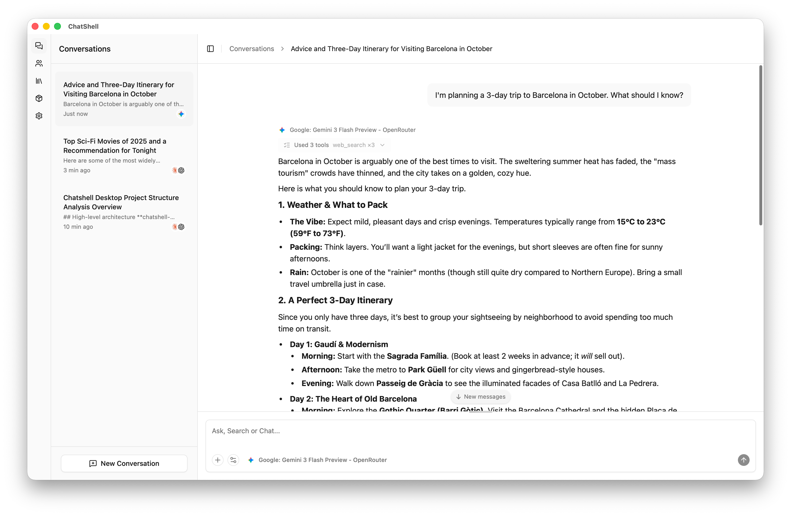
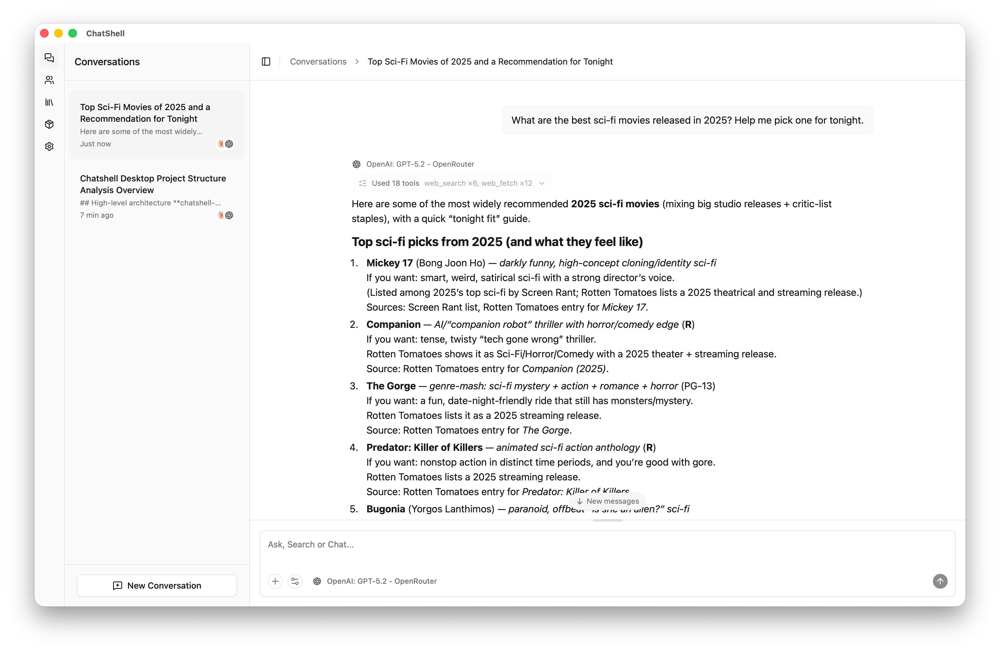
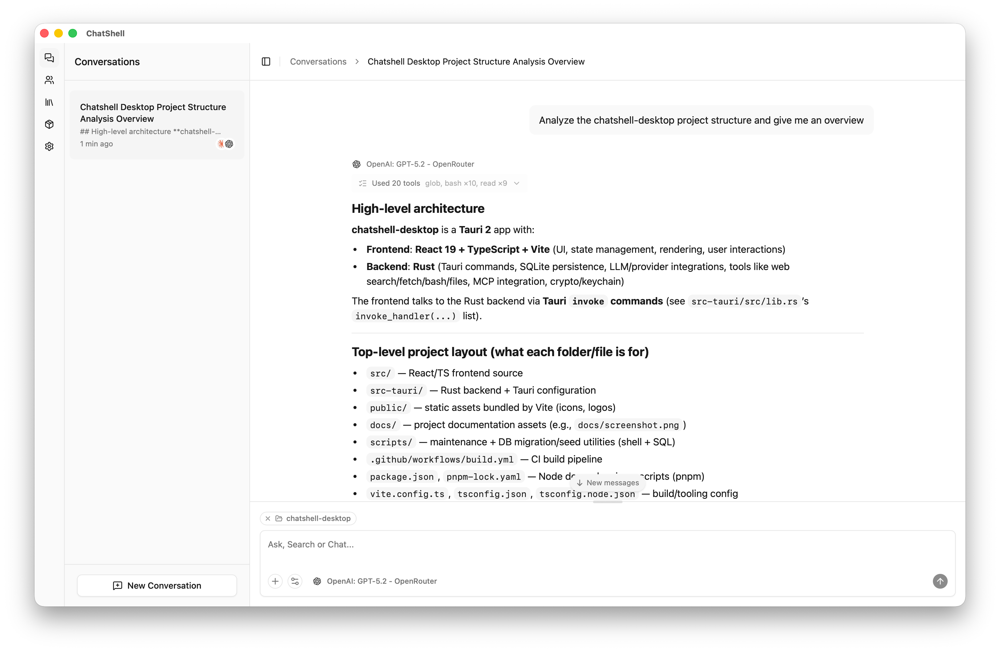

# ChatShell

**Your AI, in a Shell. Stand Alone, Yet Connected.**

[](https://github.com/chatshellapp/chatshell-desktop/stargazers)
[](LICENSE)
[](https://www.rust-lang.org/)
[](https://react.dev/)

ChatShell is a free, open-source desktop AI client that works as a fully capable AI agent right out of the box. No plugins to install, no MCP servers to configure — ChatShell ships with built-in tools for web search, web browsing, file access, and shell execution, so your AI can take real actions from the very first conversation.

Built on Tauri 2 with a Rust backend, ChatShell is fast, lightweight, and runs on macOS, Windows, and Linux.

[Website](https://chatshell.app/) | [GitHub](https://github.com/chatshellapp/chatshell-desktop) | [Issues](https://github.com/chatshellapp/chatshell-desktop/issues)

---

## Screenshots



<details>
<summary>More screenshots</summary>





</details>

---

## Why ChatShell?

### Agent-Ready, Out of the Box

Most AI clients are just chat wrappers — you type, the AI replies, end of story. ChatShell ships with **9 built-in tools** (Web Search, Web Fetch, Bash, Read, Edit, Write, Grep, Glob, Kill Shell) that your AI can use autonomously. Ask it to research a topic, summarize a web page, find a file on your disk, edit code, or run a command — it just works. No MCP servers to set up, no plugins to install, no config files to edit.

Other clients like OpenClaw require tedious configuration before your AI can do anything beyond chatting. With ChatShell, you get a working AI agent in under a minute.

### Powerful Skills System

Go beyond simple prompts. **Skills** bundle prompt instructions with required tools into reusable, composable capabilities. Create your own by dropping a `SKILL.md` file into `~/.chatshell/skills/<skill-name>/`. Each skill declares which tools it needs — those tools are enabled automatically when the skill is active. You control whether the AI triggers a skill on its own or waits for you to invoke it.

### Custom Assistants, Built Locally

Create personalized AI assistants entirely on your machine. Each assistant packages together a model, system prompt, user prompt, tools, skills, and a custom avatar — forming a complete AI persona you can switch between instantly. Organize them into groups, star your favorites, and reuse prompts from your library. No cloud account needed, no sharing of your data.

### Lightweight by Design

Built on **Tauri 2 with a Rust backend** — not Electron. ChatShell uses significantly less memory and disk space while delivering native-level performance on all three platforms (macOS, Windows, Linux).

### True Privacy

API keys encrypted with **AES-256-GCM** and stored in your OS keychain (Apple Keychain, Windows Credential Manager, Secret Service). All data in local SQLite. No telemetry. No cloud dependency with local models.

### Permissive Open Source

**Apache 2.0** — use it commercially, fork it, embed it. No AGPL restrictions, no per-seat pricing, no subscriptions.

---

## Features

### Agent-Ready Built-in Tools

Your AI can use these tools autonomously — no user intervention needed:

- **Web Search**: Multi-engine web search (DuckDuckGo, Baidu, Yahoo) with stealth mode
- **Web Fetch**: Intelligent content extraction from URLs (Readability + headless Chrome, or Jina Reader API)
- **Bash**: Execute shell commands in a per-conversation working directory
- **Read**: Read file contents from the local filesystem (text, images, PDFs)
- **Edit**: Make precise text replacements in files
- **Write**: Create or overwrite files with provided content
- **Grep**: Search file contents with regex support
- **Glob**: Find files by pattern matching
- **Kill Shell**: Terminate the current bash session and start fresh

The AI decides when and how to combine these tools to fulfill your requests.

### Skills

- **Prompt + Tools**: Bundle instructions with required tools for specialized capabilities
- **Built-in & Custom**: Use pre-built skills or create your own (`~/.chatshell/skills/<skill-name>/SKILL.md`)
- **Invocation Control**: Choose whether the AI or the user triggers each skill
- **Auto-Discovery**: Skill Scanner finds skills from configured directories
- **Per-Conversation Selection**: Enable different skills for different conversations

### Custom Assistants

- **Full Configuration**: Each assistant combines a model, system/user prompts, tools, skills, and avatar into one reusable persona
- **Prompt Library Integration**: Select prompts from your library or write custom ones
- **Tool & Skill Assignment**: Pick which built-in tools, MCP servers, and skills each assistant can use
- **Groups & Favorites**: Organize assistants by category, star frequently used ones for quick access
- **Custom Avatars**: Personalize with emoji + color backgrounds

### 40+ AI Providers

- **Major Cloud**: OpenAI, Anthropic, Google Gemini, Azure OpenAI, OpenRouter, DeepSeek, Groq, Mistral, Perplexity, Together AI, xAI, Cohere, Moonshot, Hyperbolic, Galadriel, MiniMax, Mira, GitHub Models, Fireworks AI, NVIDIA NIM, Hugging Face, Cerebras, and more
- **Chinese Cloud**: Alibaba Qwen, Zhipu AI, Baichuan, Doubao, Tencent Hunyuan, Baidu Cloud, SiliconFlow, ModelScope, StepFun, Xiaomi MiMo, and more
- **Local**: Ollama, LM Studio, GPUStack, OVMS — run LLMs entirely on your machine
- **Custom Endpoints**: Connect any OpenAI-compatible or Anthropic-compatible API
- **Smart Model Discovery**: Automatically fetch available models from 30+ providers
- **Configurable Parameters**: Temperature, max tokens, top-p, frequency/presence penalty, and more
- **Parameter Presets**: Save and reuse model configurations across conversations

### MCP (Model Context Protocol) Integration

- **Extensible Tool System**: Connect AI with external tools and data sources
- **Server Management**: Add, configure, and manage MCP servers from the UI
- **Dynamic Tool Discovery**: Automatically detect and expose tools from MCP servers
- **Seamless Integration**: AI can invoke MCP tools naturally during conversations
- **Dual Transport**: STDIO (local child processes) and Streamable HTTP (remote servers)
- **Enterprise-Grade Auth**: None, Bearer token, or OAuth 2.0/2.1 (with PKCE) for HTTP servers
- **Per-Conversation Selection**: Enable different MCP servers for different conversations

### Rich Conversations

- **Streaming Responses**: See AI output as it generates in real time
- **Thinking Display**: View the model's reasoning process (for supported models)
- **Auto Title Generation**: Smart conversation titling
- **Context Window Control**: Configurable message context (5, 10, 20, 50, 100, or unlimited)
- **Working Directory**: Per-conversation working directory for file system tools
- **Persistent History**: All conversations stored locally in SQLite

### Powerful Attachments

- **Drag & Drop**: Easily attach files to conversations
- **Clipboard Paste**: Paste images directly from clipboard
- **Smart File Detection**: Automatic type recognition with content deduplication (Blake3)
- **Documents**: Markdown, code files (JS, TS, Python, Rust, Go, Java, C/C++, etc.), JSON, YAML, TOML, XML, SQL, shell scripts, and plain text
- **Images**: PNG, JPEG, GIF, WebP, BMP — with built-in lightbox viewer
- **Web Pages**: Paste URLs to automatically fetch and attach page content

### Web-Enabled Agents

- **Intelligent Search Decision**: AI autonomously determines when to search the web
- **Multi-Engine Support**: DuckDuckGo, Baidu, Yahoo
- **Smart Web Fetching**: Extract and summarize content from URLs
- **Dual Fetch Modes**: Local (Readability + headless Chrome) or API (Jina Reader)
- **Configurable Local Methods**: Auto, fetch-only, or headless-only

### Prompt Management

- **Prompt Library**: Store and organize reusable prompts
- **Categories**: Group prompts by use case
- **Starred Prompts**: Mark frequently used prompts for quick access
- **System & User Prompts**: Separate system-level templates from user-level prompts
- **Quick Select**: Rapidly apply prompts from within the chat input

### Export

- **Screenshot Export**: Export conversations as PNG images via html-to-image
- **Flexible Scope**: Export all messages, a single conversation, or an individual message
- **Theme-Aware**: Exports respect current light/dark mode setting

### Privacy-First Design

- **Local SQLite Storage**: All data stays on your machine
- **Encrypted Secrets**: API keys stored securely with AES-256-GCM
- **Keychain Integration**: Native OS credential storage (Apple Keychain, Windows Credential Manager, Secret Service)
- **Secure Token Storage**: MCP bearer tokens and OAuth tokens stored in the system keychain
- **No Cloud Dependency**: Works entirely offline with local models

---

## Installation

Download **signed binaries** from [chatshell.app](https://chatshell.app/) or build from source.

## Development

### Prerequisites

- Node.js 20+
- pnpm
- Rust 1.85+

### Quick Start

```bash
pnpm install
pnpm tauri dev
```

The app will be available at `http://localhost:1420`

### Testing

```bash
pnpm test                    # Run frontend tests
pnpm test:watch              # Watch mode
cd src-tauri && cargo test   # Run backend tests
```

For detailed commands and coding guidelines, see [CONTRIBUTING.md](CONTRIBUTING.md).

### Build

```bash
pnpm tauri build
```

---

## Tech Stack

| Layer | Technology |
|-------|-----------|
| Framework | [Tauri 2](https://tauri.app/) |
| Frontend | React 19, TypeScript, Vite 6 |
| Styling | TailwindCSS 4, Radix UI, Lucide icons |
| State | Zustand + Immer |
| Markdown | react-markdown, remark-gfm, KaTeX, Mermaid |
| Backend | Rust (Edition 2024), Tokio |
| LLM | [rig-core](https://rig.rs/) |
| MCP | [rmcp](https://github.com/modelcontextprotocol/rust-sdk) (HTTP + STDIO transports) |
| Database | SQLite via sqlx |
| Security | AES-256-GCM, keyring, Blake3 |
| Web Scraping | Readability, headless Chrome, htmd |

---

## Contributing

Contributions are welcome! Please read [CONTRIBUTING.md](CONTRIBUTING.md) for guidelines.

### Ways to Contribute

- Submit issues for bugs or feature requests
- Create pull requests for code improvements
- Improve documentation
- Report security vulnerabilities

---

## Security

For security vulnerabilities, please report via [GitHub Security Advisory](https://github.com/chatshellapp/chatshell-desktop/security/advisories)

---

## License

Apache 2.0 - See [LICENSE](LICENSE) for details.

---

## Acknowledgements

Built on the shoulders of giants:

- [Tauri](https://tauri.app/) — Build smaller, faster, and more secure desktop applications
- [Rig](https://rig.rs/) — Modular LLM application framework
- [rmcp](https://github.com/modelcontextprotocol/rust-sdk) — Model Context Protocol SDK for Rust
- [Radix UI](https://www.radix-ui.com/) — Unstyled, accessible UI components
- [shadcn/ui](https://ui.shadcn.com/) — Beautiful, customizable components built with Radix UI and TailwindCSS
- [React](https://react.dev/) — The library for web and native user interfaces
