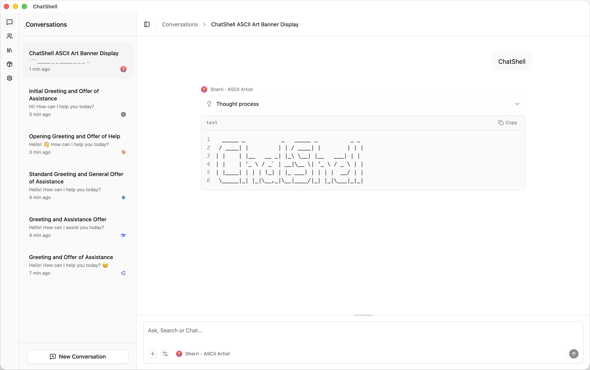

# ChatShell

**Your AI, in a Shell. Stand Alone, Yet Connected.**

[](https://github.com/chatshellapp/chatshell-desktop/stargazers)
[](LICENSE)
[](https://www.rust-lang.org/)
[](https://react.dev/)

ChatShell is an open-source desktop AI client built with Tauri 2 and React 19. Chat with 20+ cloud and local models, equip agents with built-in tools and MCP servers, search the web, manage skills and prompts, and export conversations — all in a native, privacy-first app.

[Website](https://chatshell.app/) | [GitHub](https://github.com/chatshellapp/chatshell-desktop) | [Issues](https://github.com/chatshellapp/chatshell-desktop/issues)

---

## Screenshot



---

## Features

### Multi-Model Support

- **20+ Cloud Providers**: OpenAI, Anthropic, Google Gemini, OpenRouter, Azure OpenAI, DeepSeek, Groq, Mistral, Perplexity, Together AI, xAI, Cohere, Moonshot, Hyperbolic, Galadriel, MiniMax, Mira, and more
- **Local Models**: Ollama — run LLMs entirely on your machine
- **Custom Endpoints**: Connect any OpenAI-compatible or Anthropic-compatible API
- **Smart Model Discovery**: Automatically fetch available models from providers
- **Configurable Parameters**: Temperature, max tokens, top-p, frequency/presence penalty, and more
- **Parameter Presets**: Save and reuse model configurations across conversations

### Rich Conversations

- **Streaming Responses**: See AI output as it generates in real time
- **Thinking Display**: View the model's reasoning process (for supported models)
- **Auto Title Generation**: Smart conversation titling
- **Context Window Control**: Configurable message context (5, 10, 20, 50, 100, or unlimited)
- **Working Directory**: Per-conversation working directory for file system tools
- **Persistent History**: All conversations stored locally in SQLite

### Powerful Attachments

- **Drag & Drop**: Easily attach files to conversations
- **Clipboard Paste**: Paste images directly from clipboard
- **Smart File Detection**: Automatic type recognition with content deduplication (Blake3)
- **Documents**: Markdown, code files (JS, TS, Python, Rust, Go, Java, C/C++, etc.), JSON, YAML, TOML, XML, SQL, shell scripts, and plain text
- **Images**: PNG, JPEG, GIF, WebP, BMP — with built-in lightbox viewer
- **Web Pages**: Paste URLs to automatically fetch and attach page content

### Web-Enabled Agents

- **Intelligent Search Decision**: AI autonomously determines when to search the web
- **Multi-Engine Support**: DuckDuckGo, Baidu, Yahoo
- **Smart Web Fetching**: Extract and summarize content from URLs
- **Dual Fetch Modes**: Local (Readability + headless Chrome) or API (Jina Reader)
- **Configurable Local Methods**: Auto, fetch-only, or headless-only

### Built-in Tools

- **Web Search**: Multi-engine web search with stealth mode
- **Web Fetch**: Intelligent content extraction from URLs
- **Bash**: Execute shell commands with per-conversation working directory
- **Read**: Read file contents from the local filesystem
- **Grep**: Search file contents with regex support
- **Glob**: Find files by pattern matching

### MCP (Model Context Protocol) Integration

- **Extensible Tool System**: Connect AI with external tools and data sources
- **Server Management**: Add, configure, and manage MCP servers from the UI
- **Dynamic Tool Discovery**: Automatically detect and expose tools from MCP servers
- **Seamless Integration**: AI can invoke MCP tools naturally during conversations
- **Dual Transport**: STDIO (local child processes) and Streamable HTTP (remote servers)
- **Authentication**: None, Bearer token, or OAuth 2.0/2.1 (with PKCE) for HTTP servers
- **Per-Conversation Selection**: Enable different MCP servers for different conversations

### Skills

- **Prompt + Tools**: Combine prompt instructions with required tools for specialized capabilities
- **Built-in & Custom**: Use pre-built skills or create your own
- **Invocation Control**: Configure whether the model or user triggers skills
- **Skill Scanner**: Automatically discover skills from configured directories

### Custom Assistants

- Create personalized AI assistants with custom system prompts
- **Parameter Presets**: Save and reuse model configurations
- **Tool Configuration**: Assign built-in tools and MCP servers per assistant
- **Skill Association**: Attach skills for specialized behavior
- **Assistant Groups**: Organize assistants by category
- **Starred Favorites**: Quick access to frequently used assistants
- **Custom Avatars**: Personalize with text or image avatars

### Prompt Management

- **Prompt Library**: Store and organize reusable prompts
- **Categories**: Group prompts by use case
- **Starred Prompts**: Mark frequently used prompts for quick access
- **System & User Prompts**: Separate system-level templates from user-level prompts
- **Quick Select**: Rapidly apply prompts from within the chat input

### Export

- **Screenshot Export**: Export conversations as PNG images via html-to-image
- **Flexible Scope**: Export all messages, a single conversation, or an individual message
- **Theme-Aware**: Exports respect current light/dark mode setting

### Privacy-First Design

- **Local SQLite Storage**: All data stays on your machine
- **Encrypted Secrets**: API keys stored securely with AES-256-GCM
- **Keychain Integration**: Native OS credential storage (Apple Keychain, Windows Credential Manager, Secret Service)
- **Secure Token Storage**: MCP bearer tokens and OAuth tokens stored in the system keychain
- **No Cloud Dependency**: Works entirely offline with local models

---

## Installation

Download **signed binaries** from [chatshell.app](https://chatshell.app/) or build from source.

## Development

### Prerequisites

- Node.js 20+
- pnpm
- Rust 1.85+

### Quick Start

```bash
pnpm install
pnpm tauri dev
```

The app will be available at `http://localhost:1420`

### Testing

```bash
pnpm test                    # Run frontend tests
pnpm test:watch              # Watch mode
cd src-tauri && cargo test   # Run backend tests
```

For detailed commands and coding guidelines, see [CONTRIBUTING.md](CONTRIBUTING.md).

### Build

```bash
pnpm tauri build
```

---

## Tech Stack

| Layer | Technology |
|-------|-----------|
| Framework | [Tauri 2](https://tauri.app/) |
| Frontend | React 19, TypeScript, Vite 6 |
| Styling | TailwindCSS 4, Radix UI, Lucide icons |
| State | Zustand + Immer |
| Markdown | react-markdown, remark-gfm, KaTeX, Mermaid |
| Backend | Rust (Edition 2024), Tokio |
| LLM | [rig-core](https://rig.rs/) |
| MCP | [rmcp](https://github.com/anthropics/rmcp) (HTTP + STDIO transports) |
| Database | SQLite via sqlx |
| Security | AES-256-GCM, keyring, Blake3 |
| Web Scraping | Readability, headless Chrome, htmd |

---

## Contributing

Contributions are welcome! Please read [CONTRIBUTING.md](CONTRIBUTING.md) for guidelines.

### Ways to Contribute

- Submit issues for bugs or feature requests
- Create pull requests for code improvements
- Improve documentation
- Report security vulnerabilities

---

## Security

For security vulnerabilities, please report via [GitHub Security Advisory](https://github.com/chatshellapp/chatshell-desktop/security/advisories)

---

## License

Apache 2.0 - See [LICENSE](LICENSE) for details.

---

## Acknowledgements

Built on the shoulders of giants:

- [Tauri](https://tauri.app/) — Build smaller, faster, and more secure desktop applications
- [Rig](https://rig.rs/) — Modular LLM application framework
- [rmcp](https://github.com/anthropics/rmcp) — Model Context Protocol SDK for Rust
- [Radix UI](https://www.radix-ui.com/) — Unstyled, accessible UI components
- [shadcn/ui](https://ui.shadcn.com/) — Beautiful, customizable components built with Radix UI and TailwindCSS
- [React](https://react.dev/) — The library for web and native user interfaces
